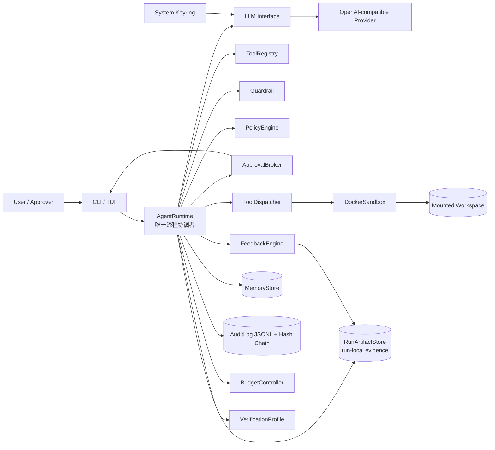
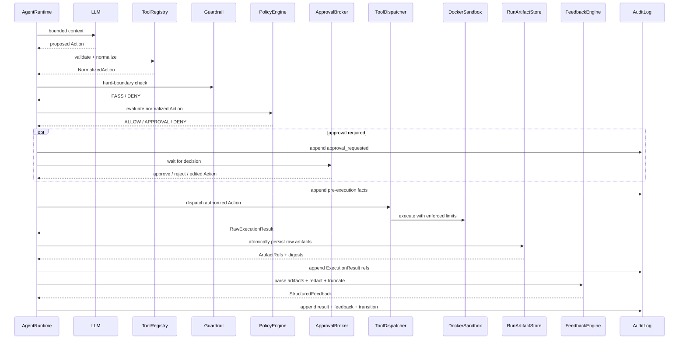

# Governed Coding Agent Harness — 产品与系统规格

版本：1.1  
日期：2026-08-14  
状态：冻结（Frozen），核心架构与范围不再扩张

## 1. 问题陈述

### 1.1 要解决的问题

现有 Coding Agent 可以生成代码并调用工具，但“模型能做什么”“危险动作何时被拦截”“人工授权究竟授权了什么”“运行后能否证明发生过什么”经常混在 Agent 自身逻辑中。模型提示词不是可靠的安全边界；一旦模型误判、受到仓库内容的 prompt injection、生成危险 shell，或工具实现存在旁路，宿主文件、凭据和网络都可能受到影响。

本项目实现一个由 Harness 掌控执行权的 Python Coding Agent。LLM 只能提出结构化 Action，Harness 负责规范化、不可覆盖的安全检查、声明式策略、必要的人工审批、Docker 隔离执行、反馈解析、预算和停机。事实事件以带哈希链的 append-only JSONL 保存，用于运行后校验与解释。

### 1.2 目标用户

- 希望安全演示 Coding Agent 自动修复闭环的学生与课程评审者。
- 研究 Agent Governance、HITL、工具安全和审计机制的开发者。
- 希望在受控本地项目中试验 OpenAI-compatible 模型的 Python 开发者。

### 1.3 为什么值得做

项目的价值不在于再实现一个聊天式代码助手，而在于把治理机制编码为可测试、可解释、不可由模型绕过的运行时路径。deterministic `MockLLM` 使治理结论无需真实模型也能复现；Docker 使规则漏判后仍有执行边界；审批指纹与审计链使人工授权和事后检查具有客观依据。这形成一个范围适中、可现场演示、也能开展对照实验的课程/作品集贡献。

### 1.4 产品目标与非目标

目标：

- 支持 Python + pytest 项目的自动读取、修改、执行和反馈修复。
- OpenAI-compatible API 与 `MockLLM` 共享统一 LLM 接口。
- 所有 Action 强制通过同一治理和沙箱链路。
- 风险规则可配置，hard safety boundary 不可被配置放宽。
- 危险动作执行前暂停，支持最小授权的 HITL。
- 运行结果可审计、可校验、可确定性汇总。

非目标：

- 多语言、多用户、分布式 Worker、远程审批或 WebUI。
- 无 Docker 的宿主执行降级模式。
- 让 LLM 修改策略、预算、凭据、审批结果或沙箱限制。
- 将 AuditLog 建成完整事件溯源数据库。
- 声称在宿主机或 Docker daemon 完全失陷时仍绝对安全。

## 2. 用户故事

以下故事保持独立、可协商、有价值、可估算、足够小且可测试（INVEST）。

### US-1：安全启动修复任务

作为 Python 开发者，我希望指定一个 workspace 和任务描述后启动 Agent，以便它只能在该项目内工作。

验收要点：非法 workspace、无效策略或不可用 Docker 必须在任何模型或工具调用前失败关闭。

### US-2：自动完成低风险动作

作为开发者，我希望安全读取和策略允许的检查自动执行，以便修复循环不因每个低风险操作而中断。

验收要点：`ALLOW` 仍必须经过 ToolDispatcher 并在 DockerSandbox 中执行。

### US-3：审批危险动作

作为审批者，我希望在危险动作执行前看到规范化参数、风险等级、命中规则和影响范围，以便批准一次或拒绝。

验收要点：动作在批准前不得产生执行副作用；批准只匹配当前 Action 指纹。

### US-4：收窄待审批动作

作为审批者，我希望修改危险 Action 的参数后再考虑执行，以便在不完全中止任务的情况下缩小权限。

验收要点：修改产生新 Action ID，并从 ToolRegistry 开始重走完整治理链。

### US-5：根据测试反馈自动修复

作为开发者，我希望 Agent 获得结构化 pytest/shell/lint 反馈，以便在预算内迭代修复，而不是读取无限原始日志。

验收要点：反馈包含退出码、错误摘要、位置、截断状态和原始结果引用。

### US-6：阻止虚假完成

作为课程评审者，我希望 Agent 提议完成后由 Harness 强制运行验收检查，以便模型不能自行宣称成功。

验收要点：只有 finish 条件满足且所有 required checks 通过才能进入 `SUCCESS`。

### US-7：追溯治理过程

作为审计者，我希望查看每个模型动作、系统验收动作、规则命中、人工决定和执行结果，以便解释任务为何成功或停止。

验收要点：运行摘要只能由通过哈希链校验的事件流生成。

### US-8：检测审计篡改

作为审计者，我希望日志被修改、删除、插入或重排时验证失败，以便发现基础的事后篡改。

验收要点：对任一非空运行日志实施上述改变，完整性检查必须失败。

### US-9：安全管理模型凭据

作为用户，我希望通过 CLI 录入、查看配置状态、更新和清除 API Key，以便密钥不出现在项目文件、命令历史或界面明文中。

验收要点：CLI 和日志只显示状态及非敏感元数据，容器永远收不到模型 API Key。

### US-10：确定性演示治理机制

作为课程评审者，我希望使用 MockLLM 重放批准、拒绝、超时、违规和成功场景，以便不依赖网络、费用或模型随机性进行验收。

验收要点：相同脚本、策略和初始 workspace 产生相同的治理事件序列与终止状态；时间戳和随机 ID 可通过测试注入固定值。

## 3. 领域与机制设计

### 3.1 Coding 领域的反馈信号

- 强信号：AcceptanceCheck 退出码、pytest 测试通过/失败、Python 语法错误。
- 中等信号：lint/type-check 诊断、失败测试位置、异常栈、覆盖率变化。
- 弱信号：模型自评、自然语言推测、未经执行验证的修复声明。
- 变化信号：文件 diff、重复 Action 指纹、相同错误签名、连续无进展次数。

`FeedbackEngine` 将强/中等信号结构化并限制长度；弱信号不能作为成功判据。原始输出保留审计引用，但不全量注入模型上下文。

### 3.2 Coding 领域的危险动作

- workspace 外读取或写入、符号链接逃逸、绝对路径逃逸。
- 删除、批量覆盖、修改 Git 元数据或隐藏配置。
- 任意 shell、命令拼接、后台进程、fork bomb、资源耗尽。
- 联网、下载或安装依赖、访问云元数据端点。
- 提权、特权容器、额外挂载、Docker socket 或宿主命名空间访问。
- 读取 `.env`、SSH key、云凭据或模型 API Key。
- 修改测试以掩盖失败、跳过 required check 或伪造验收输出。

### 3.3 所需工具

首版 ToolRegistry 提供：`list_files`、`read_file`、`write_file`、`shell`、`pytest`，以及 VerificationProfile 可引用的受控 check Action。所有工具只描述能力，不持有流程控制权；ToolDispatcher 是唯一分发入口，DockerSandbox 是唯一执行入口。

`ShellAction` 不接受自由 shell string，最小 schema 为：

- `argv: list[str]`：非空参数数组，逐参数传给进程；
- `cwd: str`：workspace 内的规范化相对目录；
- `env: dict[str, str]`：可选且受 allowlist 与脱敏规则限制；
- `timeout_seconds: int`：不得超过 hard maximum；
- `stdin: str | null`：可选、有大小上限且不得携带 Harness 凭据。

执行必须使用 `shell=False` 或等价的直接 argv API。首版由 ToolRegistry/Guardrail 拒绝 `sh -c`、`bash -c`、PowerShell command string 及其他显式 shell 解释器求值模式，YAML Policy 和人工审批不能覆盖；未来若支持，必须作为新的受治理 Action 能力另行设计，不在首版范围。

### 3.4 记忆需求

MemoryStore 只保存可复用的推导性知识：已确认项目约定、重复失败模式、通过 required checks 验证的修复经验、人工明确保存的信息。单次失败、普通 stdout/stderr、模型猜测和任何凭据不得进入长期记忆。检索不调用 LLM 或 embedding 服务，而采用有限、可确定性测试的规则：先按 `workspace_id` 和允许的 memory kind 过滤，再按规范化 token/tag 交集、证据等级与更新时间计算整数分数，以 `score DESC, updated_at DESC, memory_id ASC` 稳定排序，最后返回配置上限 `top_k` 和总字符上限内的条目。

### 3.5 重点维度与编码方式

项目把 Governance/HITL 作为主要贡献，因为 coding Agent 的核心风险来自“可产生真实副作用的工具调用”，而不只是回答质量。机制编码如下：

- Pydantic 类型化 Action schema 消除自由文本直接执行。
- `AgentRuntime` 显式状态机保证唯一协调路径。
- `Guardrail` 编码不可覆盖的不变量。
- YAML `PolicyEngine` 编码可解释的项目风险决策。
- Action 指纹编码最小范围的一次性授权。
- Docker 参数编码真正的执行边界。
- `VerificationProfile` 编码“成功必须由系统验证”。
- 哈希链事件编码事实顺序与 tamper-evidence。
- 注入式时钟、ID 生成器、MockLLM 和审批器编码确定性测试能力。

## 4. 功能规约

### 4.1 CLI/TUI 与任务管理

- 输入：workspace 路径、任务描述、策略文件、VerificationProfile、模型配置名称和预算覆盖值。
- 行为：解析参数、显示运行状态与事件、收集审批、管理凭据、接受中断；业务决策全部委托给 AgentRuntime。
- 输出：实时 TUI、退出码、运行 ID、AuditLog 路径和最终摘要。
- 边界条件：单进程同一时间只运行一个任务；非交互环境若遇到 `REQUIRE_APPROVAL`，按超时/拒绝策略处理。
- 错误处理：workspace、Docker、策略或 profile 预检失败时不调用 LLM；凭据缺失时引导安全录入。

### 4.2 AgentRuntime 状态机

- 输入：Task、组件接口、预算、策略版本和 VerificationProfile。
- 行为：构建上下文，调用 LLM，依序驱动规范化、治理、审批、执行、反馈、记忆提炼和验收；先记录事实事件再推进状态。
- 输出：下一状态、结构化反馈或唯一终止状态。
- 边界条件：只有 AgentRuntime 能推进流程；LLM、Tool、Memory 和 UI 都不能直接转移状态。
- 错误处理：捕获组件的类型化错误并交给集中终止裁决器；未知异常安全停止并尽力记录。

### 4.3 LLM 抽象、OpenAICompatibleLLM 与 MockLLM

- 输入：任务、有界相关记忆、最近反馈、可用 Action schema 和剩余预算摘要。
- 行为：请求一个结构化 Action、`finish` 或说明性消息；MockLLM 按测试脚本确定性返回。
- 输出：经 schema 初检的 `ModelDecision`。
- 边界条件：模型不可访问 Tool、Docker、CredentialStore 或宿主文件；模型不能提高预算或标记最终成功。
- 错误处理：非法结构形成验证反馈；临时 API 错误有限退避重试；耗尽后进入 `MODEL_UNAVAILABLE`。

### 4.4 ToolRegistry

- 输入：原始 Action type、参数、source、workspace ID 和来源元数据。
- 行为：查找 schema、类型校验、填充默认值、规范化路径与参数、生成 canonical representation。
- 输出：`NormalizedAction` 或确定性 validation error。
- 边界条件：未知工具、额外字段和不能 canonicalize 的参数均拒绝；规范化本身不得执行工具副作用。ShellAction 必须使用非空 `argv`、workspace 内 `cwd`、受限 `env`、有上限的 timeout/stdin，不接受 shell string 或显式 shell 解释器求值模式。
- 错误处理：错误写入审计并反馈 LLM；不进入 Guardrail 之后的链路。

### 4.5 Guardrail

- 输入：NormalizedAction、已解析 workspace identity 和不可变安全配置。
- 行为：检查路径、挂载、宿主执行、提权、网络和资源 hard maximum 等不变量。
- 输出：`PASS` 或带原因码的 `GUARDRAIL_DENY`。
- 边界条件：YAML 与人工批准均不能覆盖；检查使用解析后的 canonical path 并防止符号链接逃逸。
- 错误处理：正常拒绝反馈 Agent；发现边界缺失、绕过或执行后约束不符时触发最高优先级 `SECURITY_STOP`。

### 4.6 PolicyLoader、SchemaValidator 与 PolicyEngine

- 输入：YAML 策略、NormalizedAction 和 Guardrail PASS 结果。
- 行为：启动时严格校验；运行时按文档化优先级匹配 Action 类型、参数与风险规则。
- 输出：`ALLOW`、`REQUIRE_APPROVAL` 或 `DENY`，以及 risk level、rule ID、reason、policy version。
- 边界条件：同等匹配采用更严格结果；无匹配采用安全默认；只匹配规范化参数。
- 错误处理：无效 YAML/schema fail closed 为 `CONFIGURATION_ERROR`；`DENY` 不允许 HITL 覆盖。

策略最小结构示例：

```yaml
version: 1
defaults:
  decision: REQUIRE_APPROVAL
  risk: medium
rules:
  - id: allow-project-read
    action_types: [read_file, list_files]
    match:
      within_workspace: true
    risk: low
    decision: ALLOW
    reason: Read-only access inside the selected workspace
```

### 4.7 ApprovalBroker

- 输入：Action、规范化参数、风险、命中规则、影响范围及单次/累计等待余量。
- 行为：暂停状态机并收集 `approve_once`、`reject` 或 `edit_and_execute`。
- 输出：类型化 ApprovalDecision 与非敏感操作人/时间元数据。
- 边界条件：批准指纹对 `{"version": 1, "action_type": ..., "normalized_args": ..., "workspace_id": ...}` 的 canonical JSON bytes 计算 SHA-256；一次批准不得复用到修改后的 Action，未来变更 canonicalization 必须提升 version。
- 错误处理：单次超时按拒绝；累计 HITL 等待预算耗尽进入 `BUDGET_EXHAUSTED`；人工编辑产生 `source=HUMAN_EDIT`、新 ID 和 parent ID，并重走全链。

### 4.8 ToolDispatcher 与 DockerSandbox

- 输入：通过 Guardrail、Policy 和必要审批的 NormalizedAction。
- 行为：ToolDispatcher 选择具体 Tool；DockerSandbox 以固定镜像和受限参数运行 Action。ShellAction 使用直接 argv 进程 API与 `shell=False` 等价语义，不经 shell 解释字符串。
- 输出：`RawExecutionResult`，包含 exit code、stdout/stderr 引用、duration、resource outcome 和 sandbox metadata。
- 边界条件：只挂载指定 workspace；默认 `network=none`；不挂载凭据/Docker socket；非特权、非 root、只读 root filesystem；限制 CPU、内存、PIDs 与超时。每个 Action 使用临时容器，代码改动仅通过 workspace 挂载持久化。
- 错误处理：timeout、OOM、PID limit、中断和异常分类返回并销毁容器；任何宿主执行尝试为安全故障。

### 4.9 FeedbackEngine

- 输入：RawExecutionResult、Action 类型和可选解析器。
- 行为：从 RunArtifactStore 读取受控原始运行产物，解析 pytest、shell 与 lint 结果，抽取失败测试、错误位置、错误签名、退出原因并脱敏、截断。
- 输出：`StructuredFeedback` 与带 digest 的 artifact reference。
- 边界条件：模型可见反馈默认不超过 64 KiB；凭据模式永远脱敏；原始大输出不得进入 MemoryStore。
- 错误处理：解析失败返回带 `parse_error=true` 的降级摘要，不丢失退出码或原始引用。

### 4.10 RunArtifactStore

- 输入：run ID、execution ID、artifact kind、原始 bytes、media type 与敏感性标记。
- 行为：将 stdout、stderr、pytest report、diff 和其他运行产物写入宿主机的 run-local 私有目录，计算 SHA-256、大小和截断信息后返回不可变引用。
- 输出：`ArtifactRef`，包含 artifact ID、kind、digest、size、media type、relative storage key、sensitive 与 truncated。
- 边界条件：目录权限为仅当前用户可访问，永不挂载给 Docker，文件名由 Harness 生成；单 artifact 与单 run 有大小/数量上限；artifact 不进入模型上下文，除非经 FeedbackEngine 脱敏与截断。业务组件只能持有 `ArtifactRef`，并通过 RunArtifactStore 的 descriptor-backed `put/read/verify` 完成证据 I/O；Store 不公开返回普通 `Path` 的安全能力。可选诊断位置只能是明确标记 diagnostic-only 的字符串，不得用于读取或验证。
- 错误处理：写入必须原子完成；ExecutionResult 事件只能引用已成功持久化的 artifact。运行中写入失败、digest 不匹配或引用越界视为执行证据完整性故障，阻止继续执行并进入 `SECURITY_STOP`。

RunArtifactStore 保存大体积证据 bytes，AuditLog 保存不可变事实、artifact ID 与 digest。artifact 内容不内联到 JSONL 哈希链，但其 digest 被链上事件覆盖：事后内容变化可检测；artifact 被删除时 Audit 链本身仍可验证，但完整证据校验必须报告 `evidence_missing`，不能声称运行证据完整。RunSummary 默认只读取结构化事件，按需显示 artifact 引用。

### 4.11 MemoryStore

- 输入：候选经验、证据引用、提炼规则和检索查询。
- 行为：只有已确认约定、重复失败、验证成功经验或人工明确保存命中规则时才新增/更新；检索返回有界相关条目。
- 输出：MemoryEntry、按固定排序与 `top_k`/字符上限截断的检索结果，或“无更新”决定。
- 边界条件：Memory 可合并、修正和淘汰，不是事实来源，不参与放宽安全决策，不存凭据。
- 错误处理：故障记录审计警告后可继续；错误 Memory 不得改写 AuditLog。

检索算法固定为 workspace/kind 过滤、规范化 token/tag 交集计分、证据等级与更新时间整数加权、`score DESC, updated_at DESC, memory_id ASC` 排序；不调用 LLM、embedding 或外部检索服务。测试注入固定时钟后必须得到确定结果。

### 4.12 AuditLog 与运行摘要

- 输入：事实事件及前一事件哈希。
- 行为：以 canonical JSON 追加 JSONL；`event_hash = SHA-256(prev_hash + canonical_json(event_without_event_hash))`；验证序号与整条链。
- 输出：append 结果、完整性报告和由合法事件流确定性生成的 RunSummary。
- 边界条件：事件只能追加；首条使用固定 genesis；摘要不读取 Memory 作为事实补充。
- 错误处理：写入、序号或链验证异常阻止后续 Action，并最终进入 `SECURITY_STOP`。

### 4.13 BudgetController 与无进展检测

- 输入：注入时钟、计数事件、预算配置和反馈错误签名。
- 行为：独立核算 wall-clock task budget、Sandbox execution budget、per-approval timeout、cumulative HITL wait budget、Agent 轮次、LLM/Tool 调用及连续无进展次数。
- 输出：剩余预算快照或耗尽原因。
- 边界条件：LLM、策略和单次人工批准不能提高运行中上限；测试可注入固定时钟。
- 错误处理：任一普通预算耗尽进入 `BUDGET_EXHAUSTED`，但不能覆盖更高优先级 `SECURITY_STOP`。

### 4.14 VerificationProfile 与 AcceptanceCheck

- 输入：LLM 的 `finish` 决策和 profile 中的 required/optional checks。
- 行为：AgentRuntime 为每个 check 创建 `source=VERIFICATION` 的系统 Action，并从 ToolRegistry 开始完整执行治理与沙箱链。
- 输出：逐项 CheckResult、结构化失败反馈或成功候选。
- 边界条件：没有安全旁路；只有 finish 条件满足且所有 required checks 通过才进入 `SUCCESS`；optional 失败只警告。
- 错误处理：required check 失败回到修复循环；策略使 required check 永远不可执行时进入 `CONFIGURATION_ERROR`，不得伪造成功。

### 4.15 CredentialStore

- 输入：CLI 交互式录入的 provider profile、API key 和非敏感 endpoint/model 元数据。
- 行为：调用系统 Keyring 创建、读取供 host LLM client 使用、更新或删除 secret。
- 输出：成功状态、是否配置和非敏感元数据；永不输出 secret。
- 边界条件：API key 只进入宿主 LLM 客户端进程内存，不注入 Docker、模型上下文、workspace、日志或 Memory。
- 错误处理：Keyring 不可用或锁定时 fail closed，并提供不含 secret 的修复提示；不降级为明文文件。

## 5. 非功能性需求

### 5.1 性能

- 在参考开发机上，排除 Docker/LLM 外部耗时后，单次 ToolRegistry + Guardrail + Policy 决策 p95 小于 50 ms。
- TUI 接收事件后 100 ms 内刷新可见状态，不阻塞 AgentRuntime。
- 模型可见的单次 StructuredFeedback 默认上限 64 KiB；超出必须截断并标记。
- AuditLog 采用逐事件 flush；不得为吞吐批处理而允许已执行 Action 没有对应的预执行事实记录。
- 首版优化目标是可解释性与正确性，不以并发任务吞吐为目标。

### 5.2 安全与凭据威胁模型

保护资产：模型 API key、宿主文件、workspace 完整性、审计事实、策略与审批语义。

威胁主体与入口：

- 恶意或被污染的仓库文本诱导模型请求越界 Action。
- 模型误判、幻觉或生成命令注入载荷。
- 恶意策略配置试图放宽 hard boundary。
- 被批准命令利用 shell、符号链接、子进程或资源耗尽绕过前置规则。
- stdout/stderr、异常、TUI 或日志意外泄露 secret。
- 本地其他用户、恶意容器进程或被攻陷的依赖尝试读取 key。

控制措施：

- API key 使用系统 Keyring；录入时使用隐藏输入，不接受 CLI 参数或环境回显。
- secret 只在宿主 LLM 客户端调用期间读取，不传给 Docker，不写入 workspace/Audit/Memory。
- 日志、异常和反馈在落盘及显示前执行 secret/pattern redaction。
- RunArtifactStore 可能包含项目自身的敏感原始输出，因此使用宿主私有目录与 `0600` 等价权限、大小/保留期限制和显式 sensitive 标记；默认 TUI/摘要不展示原始 bytes。Harness 的模型 API key 因从不进入容器，不应出现在运行 artifact 中。
- hard boundary 先于 YAML Policy，Policy 先于审批，Sandbox 最终强制边界。
- workspace 采用 canonical path 和符号链接检查；容器无网络、无特权、无额外挂载。
- Action schema、指纹和 source 防止文字批准被扩大解释。
- Audit 哈希链提供 tamper-evidence，SECURITY_STOP 具有最高终止优先级。

剩余风险：同一宿主账户可访问已解锁 Keyring；key 在 API 调用期间存在于进程内存；宿主机、内核或 Docker daemon 完全失陷超出首版保证；供应商仍可接收任务上下文中的项目内容。文档必须明确这些边界。

### 5.3 可用性

- 首次运行提供 Docker、Keyring、策略和模型连接预检。
- 审批界面同时显示规范化 Action、风险、理由、workspace、剩余等待时间和可选决定。
- Ctrl-C 可取消当前容器并生成尽可能完整的摘要。
- 所有拒绝与停止使用稳定 reason code 和面向用户的简明说明。
- MockLLM 演示不要求网络或真实凭据。

### 5.4 可观测性

- 每次运行分配 run ID，每个 Action、审批、执行和反馈具有可关联 ID。
- TUI 展示状态迁移；JSONL 保存机器可读事实；RunSummary 提供人类可读结果。
- 事件至少包含时间、序号、source、状态、Action ID、规则版本、风险、预算快照与哈希字段。
- 不记录模型 chain-of-thought；只记录模型提供的结构化决策与必要说明。
- 提供 `audit verify` 与 `run summary` CLI 命令。

### 5.5 可靠性与可测试性

- 核心组件以 Protocol/接口注入；时间、ID、LLM、审批与执行结果可替换。
- 配置和策略启动时严格校验；错误默认 fail closed。
- 相同 MockLLM 脚本、初始 workspace、策略、固定时钟与 ID 生成器产生相同语义事件序列。
- 不要求对时间戳、耗时或 Docker 内部随机标识做跨机器字节级一致。

## 6. 系统架构

### 6.1 组件图



所有业务箭头由 AgentRuntime 发起。图中组件间连线表示数据依赖，不授予其他组件推进状态机的能力。

### 6.2 主数据流



### 6.3 外部依赖

| 依赖 | 用途 | 信任边界与降级 |
|---|---|---|
| OpenAI 或其他 OpenAI-compatible API | 真实模型决策 | 外部网络服务；不可用时有限重试后停止，不影响 MockLLM 验收 |
| Docker Engine / Docker Desktop | 唯一工具执行沙箱 | 高权限本地依赖；预检失败则不启动任务 |
| Python 系统 Keyring 后端 | API key 存储 | 依赖 OS keychain/Secret Service；不可用时不降级为明文 |
| pytest | 默认 required AcceptanceCheck | 固定在受控 Sandbox 镜像中执行 |
| 可选 lint/type-check 工具 | 附加反馈或验收 | 只有 profile 声明且镜像具备时启用 |
| 本地文件系统 | workspace、Audit、Memory、RunArtifact | workspace 挂载给容器；Audit/Memory/Artifact 保留在宿主 Harness 状态目录且不挂载给容器 |
| GitHub Actions 或等价 CI | 自动测试与发行 gate | 核心 jobs 不获取真实模型 secret；真实模型 smoke test 独立且可选 |
| PyPI 与 OCI registry | CLI 包和 Sandbox 镜像分发 | 发行记录包校验和与 immutable image digest；凭据不进入产物 |

## 7. 数据模型

### 7.1 主要实体

| 实体 | 主要字段 | 约束 |
|---|---|---|
| `Task` | task_id, prompt, workspace_id, policy_version, verification_profile_id, budgets | workspace_id 启动后不可变 |
| `Run` | run_id, task_id, state, started_at, ended_at, terminal_reason | 只有一个最终状态；SECURITY_STOP 优先级最高 |
| `Action` | action_id, source, parent_action_id, type, raw_args, normalized_args, workspace_id, round | source 为 MODEL/VERIFICATION/HUMAN_EDIT；执行前必须规范化 |
| `GovernanceDecision` | action_id, guardrail_result, policy_decision, risk, rule_id, reason, policy_version | 一个规范化 Action 对应一组不可变决策事实 |
| `ApprovalRequest` | request_id, action_id, fingerprint_version, fingerprint, requested_at, expires_at, risk | fingerprint 绑定 version + type + normalized args + workspace |
| `ApprovalDecision` | request_id, decision, decided_at, actor_meta, reason, replacement_action_id | 不保存敏感身份凭据；edited 必须关联新 Action |
| `ExecutionResult` | execution_id, action_id, exit_code, stdout_artifact, stderr_artifact, report_artifacts, duration, outcome, sandbox_meta | 只能来自 DockerSandbox；artifact 字段为带 digest 的引用 |
| `RunArtifact` | artifact_id, run_id, execution_id, kind, sha256, size, media_type, storage_key, sensitive, truncated | run-local、不可变引用、路径由 Harness 生成且不挂载给容器 |
| `StructuredFeedback` | feedback_id, action_id, category, summary, locations, error_signature, truncated, artifact_refs | 模型可见内容有长度与脱敏约束 |
| `MemoryEntry` | memory_id, workspace_id, kind, content, evidence_refs, confidence, created_at, updated_at | 必须命中提炼规则；不得含 secret |
| `AuditEvent` | run_id, seq, event_type, state, action_id, source, payload, prev_hash, event_hash | run_id + seq 唯一；哈希链连续 |
| `BudgetSnapshot` | run_id, wall_clock, sandbox_time, hitl_wait, rounds, llm_calls, tool_calls, no_progress | 单调消耗，不允许运行中上调上限 |
| `VerificationProfile` | profile_id, name, finish_condition, checks | 至少一个 required check |
| `AcceptanceCheck` | check_id, action_template, required, timeout, resource_limits | 运行时实例化为 source=VERIFICATION Action |
| `CredentialProfile` | provider_id, endpoint, model, keyring_service, keyring_username, configured | 不包含 API key 值 |

### 7.2 关系

- Task 1—N Run；Run 1—N Action 与 AuditEvent。
- Action 1—1 GovernanceDecision，Action 0—1 ApprovalRequest，ApprovalRequest 0—1 ApprovalDecision。
- HUMAN_EDIT Action 通过 parent_action_id 指向被替换 Action。
- Action 0—1 ExecutionResult，ExecutionResult 0—N RunArtifact 且 0—1 StructuredFeedback。
- AuditEvent 通过 artifact ID 与 digest 引用 RunArtifact；artifact bytes 不内联到 AuditLog。
- VerificationProfile 1—N AcceptanceCheck；每次 check 生成一个 Action。
- MemoryEntry 通过 evidence_refs 引用 AuditEvent/Action，但 AuditEvent 不依赖 MemoryEntry 才能解释事实。

### 7.3 哈希与 canonicalization

JSON 使用固定 UTF-8、排序键、稳定数字/布尔表示和无非语义空白的 canonical serializer。事件哈希：

```text
event_hash = SHA-256(prev_hash + canonical_json(event_without_event_hash))
```

审批指纹使用 versioned canonical object，禁止简单字符串拼接：

```json
{
  "version": 1,
  "action_type": "shell",
  "normalized_args": {"argv": ["pytest", "-q"], "cwd": "."},
  "workspace_id": "workspace-canonical-id"
}
```

最终值为上述对象 canonical JSON UTF-8 bytes 的 SHA-256。

哈希链提供 tamper-evidence，而非宿主完全失陷下的不可篡改保证。

## 8. 凭据与分发设计

### 8.1 Key 生命周期

- 录入：`harness credentials set <provider>` 交互式隐藏输入；拒绝通过命令参数传 key。
- 状态：`harness credentials status` 只显示 provider、endpoint、是否配置和最后更新时间。
- 更新：重新交互输入并原子替换 Keyring 条目，旧值不写日志。
- 清除：`harness credentials clear <provider>` 二次确认后删除 Keyring 条目，并验证读取失败。
- 使用：OpenAICompatibleLLM 调用前按 profile 从 Keyring 读取，只保留在宿主进程内存，不传入 Docker。
- 脱敏：已知 secret 与常见 token 形式在异常、事件 payload、反馈和 TUI 显示前统一过滤。

### 8.2 分发形态

- Python CLI/TUI 以 PyPI 包发布，推荐通过 `pipx install` 隔离安装。
- Sandbox 镜像独立发布到 OCI registry，并在发行配置中固定 immutable digest；镜像内预装 Python、pytest 和最小工具集。
- 源码仓库提供开发用 Dockerfile、默认安全策略、VerificationProfile 和 MockLLM 演示 fixture。
- 不把模型 API key 烘焙进 wheel、镜像、`.env` 或示例配置。

### 8.3 目标平台与目标机配置

- 一级支持：Linux x86_64，Docker Engine，Secret Service 或兼容 Keyring backend。
- 二级支持：macOS 13+ 与 Docker Desktop，使用 macOS Keychain。
- 二级支持：Windows 11 的 WSL2 + Docker Desktop；凭据在运行 Harness 的 WSL/系统 Keyring backend 中配置。
- 原生 Windows（不经 WSL2）和无 Docker 环境不属于首版保证范围。

目标机首次使用流程：安装 CLI、安装/启动 Docker、拉取并校验固定 digest 镜像、运行 `harness doctor`、通过隐藏输入录入 provider key、创建或选择策略/profile，然后启动任务。凭据不随项目或分发包迁移，每台目标机独立配置。

## 9. 技术选型与理由

| 领域 | 选型 | 理由 |
|---|---|---|
| 语言 | Python 3.12+ | 与目标 Python/pytest 生态一致，类型与异步库成熟，课程实现成本可控 |
| CLI | Typer | 类型驱动命令、帮助信息和子命令适合 credentials/audit/run 工作流 |
| TUI | Textual | Python 原生、事件驱动，支持异步状态展示与可自动测试的 TUI |
| 数据校验 | Pydantic v2 | 统一 Action、Policy、事件和配置 schema，支持严格验证与 JSON Schema |
| YAML | PyYAML safe loader + Pydantic schema | YAML 便于展示声明式策略；safe loader 禁止任意对象构造，Pydantic 承担语义校验 |
| LLM 客户端 | 自有 Protocol + OpenAI Python SDK adapter | 保持 Harness 与供应商解耦，同时优先支持 OpenAI-compatible API |
| LLM 供应商 | 默认 OpenAI；允许配置兼容 endpoint | 默认路径清晰，MockLLM 保证核心验收不依赖供应商 |
| HTTP | SDK 内部客户端；必要时 httpx | 明确超时、重试与可测试 transport，不让 HTTP 逻辑侵入 AgentRuntime |
| 沙箱 | Docker Engine/SDK 或受控 CLI adapter | 能强制网络、挂载、资源与进程边界，符合纵深防御目标 |
| 凭据 | Python `keyring` + OS Keychain/Secret Service | 避免自建加密密钥管理和明文配置 |
| 审计 | 本地 JSONL + SHA-256 hash chain | 易查看、易演示、可确定性验证，复杂度低于事件数据库 |
| Memory | 宿主本地轻量结构化存储 | 支持按 workspace 检索与可变知识，语义上与 append-only Audit 分离 |
| 测试 | pytest、pytest-asyncio、Docker 集成 fixture | 与目标工作流一致，支持确定性异步和隔离测试 |
| CI | GitHub Actions | 适合仓库级 unit、离线 E2E、Python package 与 OCI image 多 job gate；可替换为等价 CI |
| 分发 | PyPI/pipx + OCI Sandbox image | CLI 与执行环境独立升级，目标机安装路径清晰 |

不包含 Web 前端，因此 Open Design 设计系统及前端 design skill 不适用。TUI 只承担展示与输入，不形成新的业务层。

相关官方资料：

- Textual 测试指南：https://textual.textualize.io/guide/testing/
- Pydantic 文档：https://docs.pydantic.dev/latest/
- Python Keyring 文档：https://keyring.readthedocs.io/en/latest/
- Docker 资源限制：https://docs.docker.com/engine/containers/resource_constraints/
- Docker none 网络：https://docs.docker.com/engine/network/drivers/none/

## 10. 独立测试策略与课程机制演示

### 10.1 测试分层

- 单元层：纯 Python、无 Docker/网络，覆盖 schema、canonicalization、Guardrail、Policy、fingerprint、预算、终止裁决、Feedback parser、Memory 提炼/检索、Audit hash chain 和 MockLLM。
- 组件层：使用 fake Keyring、fake clock/ID、fake approval、fake artifact filesystem 和 fake Sandbox，验证 AgentRuntime 调用顺序、先审计后迁移与错误分类。
- Docker 集成层：在临时 workspace 中验证挂载、无网络、非特权、资源/PID/timeout、structured argv、artifact 持久化以及无宿主执行旁路。
- 离线端到端层：使用 deterministic MockLLM、固定策略/profile/clock/ID 和 fixture workspace，覆盖完整修复循环，不访问真实 LLM 或公网。
- 可选真实模型烟雾层：只验证 adapter 兼容性，不作为课程核心测试或 merge gate 的必要条件。
- 篡改/负向层：修改 AuditEvent、artifact bytes、策略、符号链接和审批输入，验证拒绝、evidence failure 与终止优先级。

单元与组件测试应占多数；Docker 测试只覆盖必须依赖真实隔离语义的边界。所有测试使用临时目录，不读取开发者真实 Keyring 或真实项目凭据。

### 10.2 三个 deterministic mechanism demo

#### DEMO-1：Governance + HITL 最小授权

fixture Agent 先提出低风险 `read_file`，再提出需要审批的 structured ShellAction。演示者选择 `edit_and_execute` 收窄 argv/cwd，新 Action 获得新 ID、重新规范化和评估，最终 `approve_once`。系统展示原指纹与新版本化 canonical 指纹不同，且原批准不能复用。固定 MockLLM、审批脚本、clock 和 ID 后，事件类型序列、规则 ID、风险级别与最终 Action 参数必须稳定。

#### DEMO-2：Feedback-driven repair + system verification

fixture 项目包含一个确定性失败测试。MockLLM 先运行 pytest，FeedbackEngine 从 RunArtifactStore 解析失败位置，再提出 `write_file` 修复并请求 finish。Harness 创建 `source=VERIFICATION` 的 required check Action，完整经过治理与 Docker 后通过。演示证明模型不能直接产生 SUCCESS，且相同 fixture 的修复轮次、反馈签名和终止状态稳定。

#### DEMO-3：Audit/artifact tamper-evidence + terminal precedence

先生成一次确定性合法运行及 RunSummary，再复制 run evidence，分别修改 Audit JSONL 事件、删除 artifact、修改 artifact bytes。验证器分别报告 hash-chain failure、`evidence_missing` 和 artifact digest mismatch。运行中注入 Audit/artifact integrity fault，并同时耗尽普通预算，最终状态必须仍为 `SECURITY_STOP`。

三个 demo 均通过 CLI 一条预设命令启动，无真实 API key、无公网依赖，并在课程展示前作为自动测试运行。

### 10.3 CI 与分发测试策略

GitHub Actions 或等价 CI 至少包含：

1. `unit-tests`：安装锁定的开发依赖，运行全部单元/组件测试与静态检查。
2. `mockllm-offline-e2e`：显式禁用外网凭据与真实 provider，运行三个 mechanism demo 和其余 MockLLM 场景。
3. `package-build`：构建 wheel/sdist，在干净环境通过 pip 安装 wheel，执行 CLI import/help/doctor 的非破坏性 smoke test。
4. `sandbox-image-build`：构建 OCI image，扫描基础配置，运行 structured argv、network=none、resource limit 与 pytest smoke test。
5. `pipeline-pass`：只在上述必需 jobs 全部成功后 PASS；它是冻结 SPEC 的最终 CI gate。

发行候选必须记录 wheel/sdist 校验和、Sandbox image immutable digest 和测试 pipeline run ID。真实模型烟雾测试不得阻塞离线核心 pipeline，也不得在 fork PR 中获得 secret。

## 11. 验收标准

### AC-1：任务预检

给定非法 workspace、无效策略、不可用 Docker 或无效 VerificationProfile，运行不得调用 LLM 或执行任何 Action，并返回稳定错误码。

### AC-2：LLM 可替换性

相同 AgentRuntime 测试分别注入 MockLLM 与 fake OpenAI-compatible adapter，无需修改治理、工具或停机代码。

### AC-3：Action 唯一路径

通过调用追踪证明 MODEL、HUMAN_EDIT 与 VERIFICATION Action 都从 ToolRegistry 开始；被拒绝的 Action 恰好停止在对应治理节点，任何进入执行的 Action 都严格按 ToolRegistry → Guardrail → PolicyEngine → 必要 ApprovalBroker → ToolDispatcher → DockerSandbox 顺序处理。Policy `ALLOW` 不得跳过 Dispatcher 或 Sandbox。

### AC-4：Hard boundary

路径逃逸、额外挂载、宿主执行、联网、提权或超限资源请求无法被 YAML `ALLOW` 或人工批准覆盖；检测到边界实际失效时最终状态为 `SECURITY_STOP`。

### AC-5：声明式策略

固定 YAML 与 NormalizedAction 产生稳定 decision、risk、rule ID 和 reason；同等规则采用更严格结果；无效 schema fail closed。

### AC-6：HITL

`REQUIRE_APPROVAL` 在执行前暂停；approve_once 只对包含 fingerprint version、type、normalized args 与 workspace ID 的 canonical JSON bytes 的 SHA-256 生效；字段边界不同但字符串拼接结果相似的对象不得碰撞为同一授权；reject/timeout 无副作用；edited Action 生成新 ID 并重走全链。

### AC-7：Docker 隔离

集成测试证明容器仅挂载 workspace、默认无网络、无 Docker socket、资源/PID/超时限制生效；ShellAction 只接受 structured argv + workspace-relative cwd，并以 `shell=False` 等价语义执行；shell string 与默认禁止的解释器求值模式被拒绝；超时与中断后无残留容器进程。

### AC-8：结构化反馈

pytest、shell 和 lint fixture 被解析为含退出码、错误位置、签名与截断标志的反馈；超过 64 KiB 的模型可见输出被截断；secret fixture 不出现在输出。

### AC-9：Memory 规则

单次失败与普通输出不产生 MemoryEntry；重复失败、验证成功经验或人工明确保存才更新。固定 workspace/kind/query/clock 的检索使用 token/tag、证据和稳定 tie-break 规则返回相同 top-k 结果，不调用 LLM/embedding；Memory 修改不影响历史 AuditEvent。

### AC-10：Audit 完整性

合法事件流通过验证并生成相同语义摘要；修改、删除、插入或重排任一事件后验证失败；Audit append 失败阻止后续 Action 并以 `SECURITY_STOP` 结束。

### AC-11：预算与终止

wall-clock、Sandbox execution、单次 approval、累计 HITL wait、轮次、LLM/Tool 调用与无进展预算分别有独立测试；并发触发时 `SECURITY_STOP` 覆盖普通终止原因。

### AC-12：系统验收动作

LLM 提议 finish 后，required checks 生成 `source=VERIFICATION` Action 并无旁路运行；任一 required check 失败不能进入 SUCCESS；全部 required checks 通过且 finish 条件满足才能成功。

### AC-13：凭据生命周期

使用 fake Keyring 验证 set/status/update/clear；状态和日志不含明文；Docker 环境与挂载中不存在 API key；Keyring 不可用时不创建明文 fallback。

### AC-14：确定性端到端场景

MockLLM 分别完成安全修复、危险动作批准、编辑后重审、拒绝后替代、审批超时、Policy DENY、required check 失败重试、预算耗尽、无进展与安全停止场景，终止状态和语义事件序列符合 fixture。

### AC-15：CLI/TUI 演示

评审者可在无真实 key、无网络的情况下启动 MockLLM 示例，看到任务状态、风险原因、审批交互、测试反馈、最终 diff、预算和审计校验结果。

### AC-16：CI 与分发

CI 存在并通过 `unit-tests`、`mockllm-offline-e2e`、`package-build`、`sandbox-image-build` 与最终 `pipeline-pass`；构建产物包含可安装 wheel/sdist 和固定 digest 的 Sandbox image，干净环境 smoke test 通过，任何必需 job 失败时最终 pipeline 不得 PASS。

### AC-17：三个课程机制 Demo

DEMO-1 至 DEMO-3 均可用预设 CLI 命令离线运行；固定输入下产生稳定语义事件序列和预期终止状态，并分别客观展示 HITL 最小授权、反馈修复与系统验收、Audit/artifact tamper-evidence 与 `SECURITY_STOP` 优先级。

### AC-18：RunArtifactStore

stdout、stderr、pytest report 与 diff 使用受限 run-local artifact 保存并返回含 SHA-256 的 ArtifactRef；AuditEvent 只保存引用与 digest。所有证据读取/验证必须经 descriptor-backed RunArtifactStore API，业务组件不得取得普通 `Path` 后自行 I/O。修改 bytes 触发 digest mismatch，删除文件报告 `evidence_missing`，越界 storage key 被拒绝；运行中 artifact 原子写入失败阻止 ExecutionResult 事件和后续 Action，并最终进入 `SECURITY_STOP`。

## 12. 错误处理与终止优先级

- Action schema 错误：不执行，形成验证反馈。
- Guardrail/Policy 拒绝：不执行原 Action，反馈 Agent 寻找安全替代。
- 配置、策略或 profile 无效：`CONFIGURATION_ERROR`。
- LLM 临时错误：有限退避并计预算；耗尽为 `MODEL_UNAVAILABLE`。
- Sandbox timeout/OOM/PID/异常：销毁容器、分类反馈；不可恢复为 `SANDBOX_FAILURE`。
- RunArtifact 写入失败、引用越界或运行中 digest 异常：阻止 ExecutionResult 事实提交和后续执行，以 `SECURITY_STOP` 结束。
- Feedback 解析失败：使用脱敏、截断的降级反馈。
- Memory 故障：记录警告后继续。
- Audit 或隔离完整性异常：停止后续执行并最终 `SECURITY_STOP`。
- 用户中断：终止容器；若无更高优先级安全异常则 `HUMAN_ABORTED`。

集中裁决器至少保证如下偏序：

```text
SECURITY_STOP > 其他所有终止状态
```

`SUCCESS` 只能在没有任何更高优先级终止候选、finish 条件成立且全部 required checks 通过时产生。普通 Guardrail/Policy 拒绝不自动终止；重复 Action 指纹或等价错误超过阈值进入 `NO_PROGRESS`。

## 13. 风险与未决问题

### 12.1 已识别风险

- Prompt injection：仓库内容可能诱导模型请求危险 Action；控制点是结构化 Action、治理链和 Docker，而不是提示词。
- 命令语义复杂：shell quoting、子 shell 和解释器可能绕过字符串匹配；默认策略应对 shell 保守，并优先匹配结构化 argv。
- Path TOCTOU：Guardrail 检查后符号链接可能变化；执行工具必须在容器内再次解析并限制实际路径。
- 审批疲劳：规则过严会导致用户机械批准；默认策略应自动允许低风险读取和验收，同时禁止“本任务全部批准”。
- Memory poisoning：模型可能把错误推测包装成经验；只有明确规则和验证证据可以进入 Memory。
- 测试规避：Agent 可能修改测试或配置来伪造通过；默认策略应把测试目录和 VerificationProfile 相关文件列为高风险或禁止修改。
- 凭据泄露：异常、供应商请求或第三方库可能暴露 key；需要集中脱敏、最小生命周期和容器隔离，但无法消除宿主内存风险。
- Docker 信任：daemon 通常具有高权限；首版依赖安全配置并固定镜像 digest，不把 Docker 本身描述为完美隔离。
- 哈希链锚点：能控制整个宿主状态的攻击者可替换日志和本地链头；首版只承诺 tamper-evidence。
- 跨平台差异：Docker Desktop、WSL2、Keyring backend 和文件权限行为不同；Linux 是一级验收平台。
- OpenAI-compatible 差异：供应商的 structured output、错误码和流式协议并不完全一致；adapter contract 必须用兼容测试约束。
- 课程交付界面冲突：当前冻结设计明确采用 CLI/TUI，但课程最终 rubric 可能要求 WebUI。必须在实现 UI 之前向教师确认；若 WebUI 是硬性要求，应作为单独 presentation adapter 变更评审，不能把业务规则迁入 UI，也不能在本 SPEC 冻结后无评审地扩张核心架构。

### 12.2 实施前需要在计划中落定的问题

- MemoryStore 的首版物理格式：建议使用宿主 SQLite 或原子 JSON；选择标准是检索测试简单且不与 Audit 语义混合。
- Docker adapter 使用 SDK 还是受控 argv CLI：建议先比较可测试性、错误分类和跨平台表现，禁止拼接 shell 字符串。
- 默认 Sandbox 镜像的依赖集合和更新策略：需要在可复现性、镜像体积与真实项目兼容性之间取舍。
- 测试文件保护规则：需要定义默认受保护路径，以及用户如何在不削弱 hard boundary 的前提下调整项目策略。
- 审计链头是否支持可选外部签名/锚定：不属于首版必需功能，但接口不应阻碍以后增加。

这些问题不会改变已确认的总体架构，应在 implementation plan 的对应任务中以小型技术验证或明确默认值收敛，不能以未决为由引入执行旁路。

## 14. 完成定义

当 AC-1 至 AC-18 全部通过，CLI/TUI 可以离线演示一次从任务输入、模型 Action、治理/HITL、Docker 执行、反馈修复、系统验收到审计校验的完整流程，三个 deterministic mechanism demo 均通过，并且每个产生副作用的 Action 都能在合法哈希链中追溯到规范化、治理、授权、artifact digest 和执行事实时，首版产品完成。
